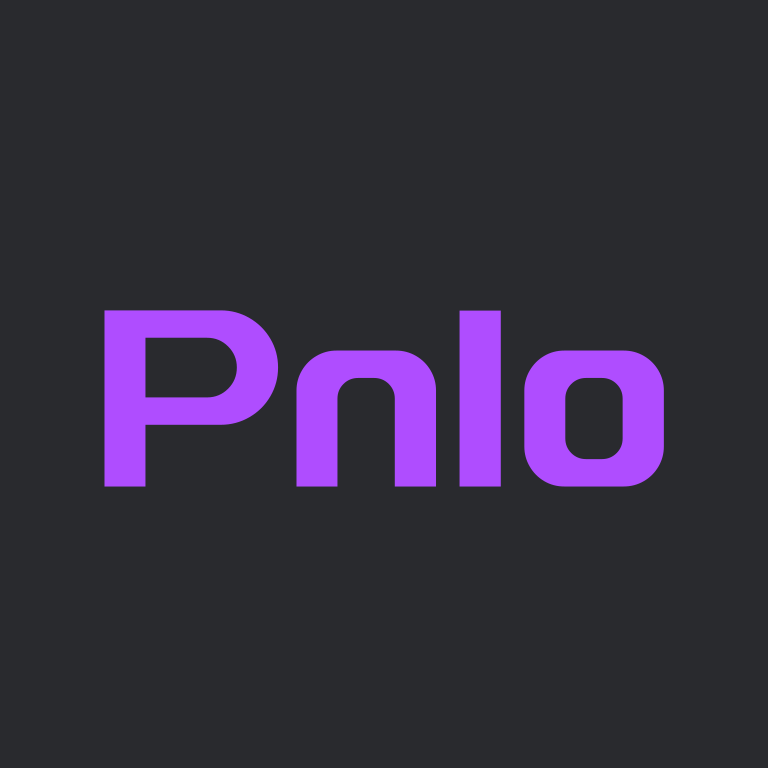

<picture>
  <source media="(prefers-color-scheme: dark)" srcset="pnlo-logo.svg">
  
</picture>

# Pnlo 0.0.1 (Purple Neon Light Object)

Pnlo配置文件代码语法简化比较好，再用这样行吧。支持压缩代码、更多嵌套。

## 代码语法

```kt
// 
//   ______   __   __     __         ______  
//  /\  == \ /\ "-.\ \   /\ \       /\  __ \   
//  \ \  _-/ \ \ \-.  \  \ \ \____  \ \ \/\ \  
//   \ \_\    \ \_\\"\_\  \ \_____\  \ \_____\ 
//    \/_/     \/_/ \/_/   \/_____/   \/_____/ 
//      
// Pnlo This is a comment, patorjk Sub-Zero
"Pnlo" = "Purple Neon Light Object";
"version" = "1.0";

Object1 = "obj-1";
Object2 = "obj-2";

"Object3" = "obj-3";
"Object4" = "obj-4";

main_obj_ = "Main Obj";
Time = 2207;
OFF = false;
ON = true;

// [obj]
//    yes = true;
// ~
```
